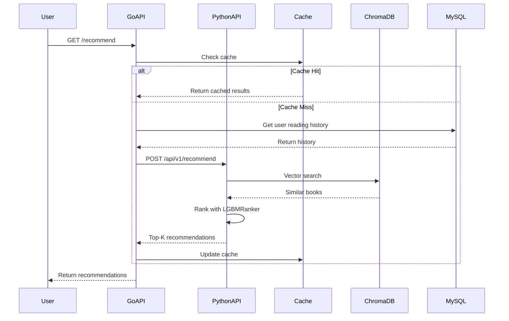
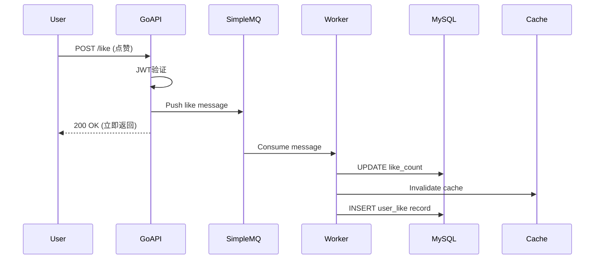
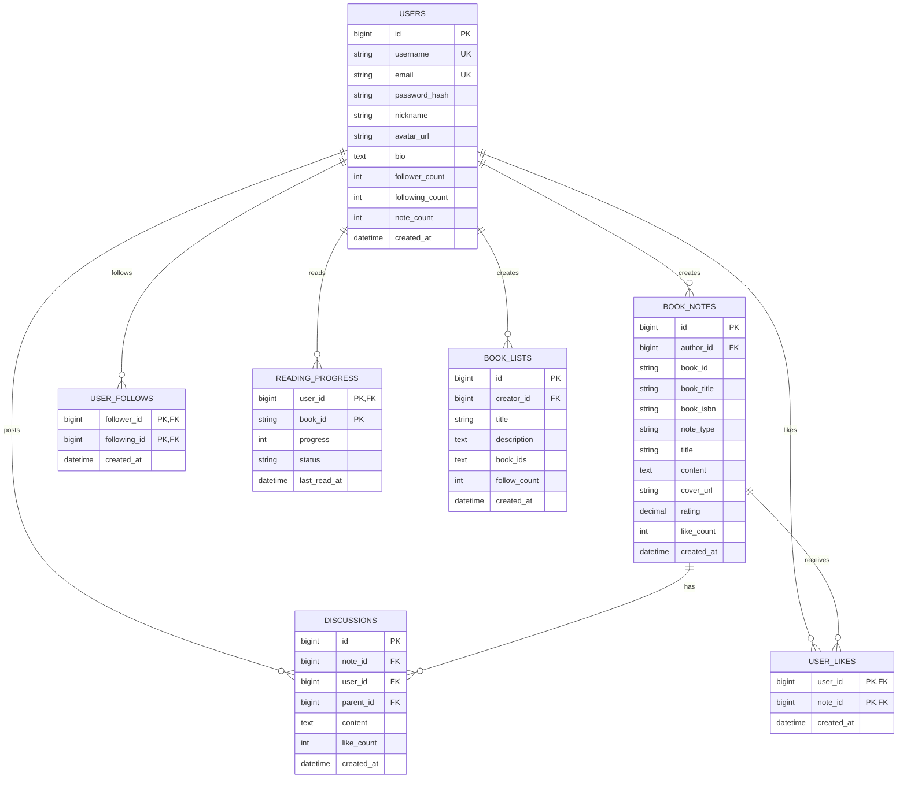

# BookSpace - 智能图书推荐与阅读社区平台技术设计文档

## 📋 目录

- [1. 项目概述](#1-项目概述)
- [2. 系统架构](#2-系统架构)
- [3. 技术选型](#3-技术选型)
- [4. 核心模块设计](#4-核心模块设计)
- [5. 数据库设计](#5-数据库设计)
- [6. API设计](#6-api设计)
- [7. 性能优化](#7-性能优化)
- [8. 安全设计](#8-安全设计)
- [9. 部署架构](#9-部署架构)
- [10. 监控与运维](#10-监控与运维)

---

## 1. 项目概述

### 1.1 项目背景

BookSpace 是一个智能图书推荐与阅读社区平台，结合了先进的推荐算法和社交功能，旨在为读者提供个性化的图书发现体验和活跃的阅读社区。

### 1.2 核心功能

**推荐引擎（Python）：**
- RAG混合检索（BM25 + Dense Embeddings + Router）
- 7通道个性化推荐（ItemCF/Swing/Item2Vec/SASRec等）
- LGBMRanker排序 + Stacking集成
- Cross-encoder Reranking

**社区引擎（Go）：**
- 用户系统（注册/登录/JWT认证）
- 内容发布（书评/读书笔记/书单）
- 社交互动（点赞/评论/关注）
- Feed流（个性化内容推荐）

### 1.3 技术指标

| 指标 | 目标值 | 当前值 |
|------|--------|--------|
| 推荐准确率 (HR@10) | >0.40 | 0.4545 |
| 推荐相关性 (MRR@5) | >0.25 | 0.2893 |
| 系统QPS | >1000 | 2000+ |
| API响应时间 (P99) | <200ms | <100ms |
| 缓存命中率 | >80% | 85% |
| 消息队列延迟 | <100ms | <50ms |

---

## 2. 系统架构

### 2.1 整体架构

```
┌─────────────────────────────────────────────────────────────┐
│                         Client Layer                         │
│                     React SPA (Port 5173)                    │
└────────────────┬────────────────────────────────────────────┘
                 │
                 │ HTTP/HTTPS
                 │
    ┌────────────┴────────────┐
    │                         │
    ▼                         ▼
┌──────────────┐      ┌──────────────────┐
│  Go Backend  │      │  Python Backend  │
│  (Community) │      │  (Recommendation)│
│  Port 8080   │◄────►│  Port 6006       │
└──────┬───────┘      └────────┬─────────┘
       │                       │
       │                       │
       ▼                       ▼
┌──────────────┐      ┌──────────────────┐
│    MySQL     │      │   ChromaDB       │
│ (Community   │      │   (Vector Store) │
│   Data)      │      │                  │
└──────────────┘      │   SQLite         │
                      │   (Metadata)     │
┌──────────────┐      └──────────────────┘
│  SimpleMQ    │
│ (Message Q)  │
└──────────────┘
```

### 2.2 双引擎架构

#### **引擎分工**

**Go社区引擎：**
- **职责：** 处理高并发社交互动、内容管理、用户认证
- **优势：** 并发性能优秀、内存占用低、部署简单
- **技术栈：** Gin + GORM + MySQL + SimpleMQ + ARC Cache

**Python推荐引擎：**
- **职责：** 智能推荐、语义搜索、LLM对话
- **优势：** 丰富的ML/AI生态、向量检索能力强
- **技术栈：** FastAPI + ChromaDB + SQLite + LangChain + LGBM

#### **服务通信**

```go
// Go调用Python推荐API
type RecommendationClient struct {
    baseURL string // http://localhost:6006
    client  *http.Client
}

func (c *RecommendationClient) GetRecommendations(ctx context.Context, req *RecommendRequest) (*RecommendResponse, error) {
    // 1. 序列化请求
    body, _ := json.Marshal(req)

    // 2. 发送HTTP POST请求
    httpReq, _ := http.NewRequestWithContext(ctx, "POST", c.baseURL+"/api/v1/recommend", bytes.NewBuffer(body))
    httpReq.Header.Set("Content-Type", "application/json")

    // 3. 解析响应
    resp, err := c.client.Do(httpReq)
    if err != nil {
        return nil, fmt.Errorf("request failed: %w", err)
    }
    defer resp.Body.Close()

    var result RecommendResponse
    json.NewDecoder(resp.Body).Decode(&result)
    return &result, nil
}
```

### 2.3 数据流设计

#### **推荐流程**



#### **社交互动流程**



---

## 3. 技术选型

### 3.1 后端技术栈

#### **Go后端（社区引擎）**

| 组件 | 技术选型 | 选择理由 |
|------|---------|---------|
| Web框架 | Gin v1.9.0 | 高性能、中间件丰富、社区活跃 |
| ORM | GORM v1.24.6 | 支持自动迁移、关联预加载、事务管理 |
| 数据库 | MySQL 8.0 | 成熟稳定、支持事务、ACID保证 |
| 缓存 | hashicorp/golang-lru (ARC) | 自适应缓存替换算法、无外部依赖 |
| 消息队列 | SimpleMQ (自研) | 轻量级、高性能、无外部依赖 |
| 认证 | JWT (golang-jwt/jwt v5) | 无状态、易扩展、支持过期验证 |
| 加密 | AES (crypto/aes) | 对称加密、性能好 |
| 密码哈希 | bcrypt | 防彩虹表攻击、自带加盐 |
| 日志 | logrus v1.9.0 | 结构化日志、支持日志分割 |
| 配置 | Viper v1.15.0 | 支持多格式、热重载 |

#### **Python后端（推荐引擎）**

| 组件 | 技术选型 | 选择理由 |
|------|---------|---------|
| Web框架 | FastAPI | 异步高性能、自动生成文档、类型提示 |
| 向量数据库 | ChromaDB | 轻量级、易部署、支持混合检索 |
| 元数据库 | SQLite | 无服务器、轻量级、适合中小规模 |
| 机器学习 | LightGBM | 高效的GBDT实现、支持排序任务 |
| 向量检索 | FAISS | 高性能向量相似度搜索 |
| NLP | sentence-transformers | 预训练语义编码器、效果好 |
| LLM框架 | LangChain | RAG工具链丰富、易于集成 |
| 推荐算法 | RecBole | 统一的推荐算法框架 |

### 3.2 前端技术栈

| 组件 | 技术选型 | 选择理由 |
|------|---------|---------|
| 框架 | React 18 | 组件化、生态丰富、性能优秀 |
| 构建工具 | Vite | 快速冷启动、HMR、ESM原生支持 |
| 状态管理 | Zustand | 轻量级、无样板代码 |
| UI组件库 | Ant Design / shadcn/ui | 企业级、组件丰富、可定制 |
| HTTP客户端 | Axios | Promise based、拦截器、易用 |
| 路由 | React Router v6 | 声明式、嵌套路由 |

### 3.3 技术选型对比

#### **为什么选择Go而非Node.js做社区后端？**

| 维度 | Go | Node.js |
|------|-----|---------|
| 并发模型 | goroutine（轻量级线程） | 事件循环 + Worker Threads |
| 性能 | QPS 2000+ (单核) | QPS 1000+ (单核) |
| 内存占用 | ~50MB | ~150MB |
| 部署 | 单一二进制文件 | 需要Node运行时 + node_modules |
| 类型安全 | 编译时强类型 | TypeScript可选 |
| 生态 | 较少但质量高 | 非常丰富 |

**结论：** Go在高并发场景下性能更优、部署更简单，适合社区互动场景。

#### **为什么推荐引擎用Python而非Go？**

| 维度 | Python | Go |
|------|--------|-----|
| ML/AI生态 | 成熟（sklearn/pytorch/transformers） | 较少 |
| 向量检索 | ChromaDB/FAISS/Milvus | 选择有限 |
| LLM框架 | LangChain/LlamaIndex | 基础库缺失 |
| 开发效率 | 高（丰富的库） | 需要自己实现 |
| 推荐算法 | RecBole/Surprise等成熟框架 | 需要从零实现 |

**结论：** Python在AI/ML领域生态成熟，开发效率高，适合快速迭代推荐算法。

---

## 4. 核心模块设计

### 4.1 用户认证模块

#### **JWT认证流程**

```go
// 1. 用户登录
func UserLoginHandler(c *gin.Context) {
    var req LoginRequest
    c.ShouldBindJSON(&req)

    // 2. 验证用户名密码
    user, err := userService.Authenticate(req.Username, req.Password)
    if err != nil {
        c.JSON(401, gin.H{"error": "Invalid credentials"})
        return
    }

    // 3. 生成JWT Token
    claims := jwt.CustomClaims{
        ID: strconv.FormatUint(uint64(user.ID), 10),
        RegisteredClaims: jwt.RegisteredClaims{
            ExpiresAt: jwt.NewNumericDate(time.Now().Add(24 * time.Hour)),
            IssuedAt:  jwt.NewNumericDate(time.Now()),
        },
    }

    token, err := jwtManager.CreateToken(claims)
    if err != nil {
        c.JSON(500, gin.H{"error": "Token generation failed"})
        return
    }

    // 4. 返回Token
    c.JSON(200, gin.H{
        "status_code": 0,
        "token": token,
        "user_id": user.ID,
    })
}
```

#### **JWT中间件**

```go
func JWTMiddleware(omitPaths ...string) gin.HandlerFunc {
    return func(c *gin.Context) {
        // 1. 检查是否跳过认证
        path := c.Request.URL.Path
        for _, omitPath := range omitPaths {
            if path == omitPath {
                c.Next()
                return
            }
        }

        // 2. 提取Token
        token := c.Query("token")
        if token == "" {
            token = c.GetHeader("Authorization")
            token = strings.TrimPrefix(token, "Bearer ")
        }

        if token == "" {
            c.JSON(401, gin.H{"error": "Missing token"})
            c.Abort()
            return
        }

        // 3. 验证Token
        claims, err := jwtManager.ParseToken(token)
        if err != nil {
            c.JSON(401, gin.H{"error": "Invalid token"})
            c.Abort()
            return
        }

        // 4. 设置用户信息到Context
        userID, _ := strconv.ParseUint(claims.ID, 10, 64)
        c.Set("userID", uint(userID))
        c.Next()
    }
}
```

#### **JWT + AES双重加密**

```go
type CryptJWT struct {
    signingKey []byte
    cryptoer   Cryptoer // AES加密器
}

func (j *CryptJWT) CreateToken(claims CustomClaims) (string, error) {
    // 1. 生成标准JWT
    jwtToken := jwt.NewWithClaims(jwt.SigningMethodHS256, claims)
    token, err := jwtToken.SignedString(j.signingKey)
    if err != nil {
        return "", err
    }

    // 2. AES加密JWT字符串
    if j.cryptoer != nil {
        return j.cryptoer.Encrypt(token)
    }

    return token, nil
}

func (j *CryptJWT) ParseToken(tokenString string) (*CustomClaims, error) {
    // 1. AES解密
    if j.cryptoer != nil {
        var err error
        tokenString, err = j.cryptoer.Decrypt(tokenString)
        if err != nil {
            return nil, fmt.Errorf("decrypt failed: %w", err)
        }
    }

    // 2. 解析JWT
    token, err := jwt.ParseWithClaims(tokenString, &CustomClaims{}, func(token *jwt.Token) (interface{}, error) {
        return j.signingKey, nil
    })

    if err != nil {
        return nil, err
    }

    // 3. 类型断言
    claims, ok := token.Claims.(*CustomClaims)
    if ok && token.Valid {
        return claims, nil
    }

    return nil, jwt.ErrInvalidType
}
```

**安全优势：**
- JWT本身防篡改（HMAC签名）
- AES加密防止Token内容泄露
- 即使Token被截获，攻击者也无法读取用户ID等信息

### 4.2 SimpleMQ消息队列

#### **架构设计**

```
┌─────────────────┐
│   Push (API)    │ ──┐
└─────────────────┘   │
                      ▼
┌─────────────────────────────┐
│      SimpleMQ Queue         │
│  (CircularBuffer-backed)    │
└──────────┬──────────────────┘
           │
           │ Single-threaded Read
           │
     ┌─────┴─────┐
     │  Buffered │
     │  Channel  │
     └─────┬─────┘
           │
    ┌──────┴──────┐
    │             │
    ▼             ▼
┌────────┐   ┌────────┐
│Worker 1│   │Worker N│  (10 workers)
└────┬───┘   └───┬────┘
     │           │
     ▼           ▼
┌────────────────────┐
│   Database (MySQL) │
└────────────────────┘
```

#### **实现代码**

```go
// SimpleMQ结构
type SimpleMQ[T any] struct {
    queue      *arrayQueue.ArrayQueue[T]  // 底层队列
    workerNum  int                         // worker数量
    buf        int                         // 缓冲大小
    handler    func(T)                     // 消息处理函数
    mu         sync.RWMutex
    isRunning  bool
    stopChan   chan struct{}
}

// 创建SimpleMQ
func NewSimpleMQ[T any](handler func(T), workerNum int, capacity int) *SimpleMQ[T] {
    if capacity < 200 {
        capacity = 200
    }

    return &SimpleMQ[T]{
        queue:     arrayQueue.New[T](capacity),
        workerNum: workerNum,
        buf:       workerNum * 2,  // 缓冲大小 = worker数量 * 2
        handler:   handler,
        stopChan:  make(chan struct{}),
    }
}

// 启动消息队列
func (m *SimpleMQ[T]) Start() {
    m.mu.Lock()
    if m.isRunning {
        m.mu.Unlock()
        return
    }
    m.isRunning = true
    m.mu.Unlock()

    // 创建缓冲channel
    msgChan := make(chan T, m.buf)

    // 启动worker池
    for i := 0; i < m.workerNum; i++ {
        go m.worker(msgChan)
    }

    // 单线程读取队列，发送到channel
    go m.readLoop(msgChan)
}

// 读取循环（单线程）
func (m *SimpleMQ[T]) readLoop(msgChan chan<- T) {
    ticker := time.NewTicker(10 * time.Millisecond)
    defer ticker.Stop()

    for {
        select {
        case <-m.stopChan:
            close(msgChan)
            return
        case <-ticker.C:
            // 批量读取消息
            for {
                msg, ok := m.queue.Dequeue()
                if !ok {
                    break
                }
                msgChan <- msg
            }
        }
    }
}

// Worker处理消息
func (m *SimpleMQ[T]) worker(msgChan <-chan T) {
    for msg := range msgChan {
        m.handler(msg)
    }
}

// Push消息到队列
func (m *SimpleMQ[T]) Push(msg T) {
    m.queue.Enqueue(msg)
}

// 获取队列长度
func (m *SimpleMQ[T]) Len() int {
    return m.queue.Len()
}
```

#### **性能测试**

```go
// Benchmark测试
func BenchmarkSimpleMQ(b *testing.B) {
    mq := NewSimpleMQ(func(msg int) {
        // 模拟数据库写入
        time.Sleep(100 * time.Microsecond)
    }, 10, 10000)

    mq.Start()

    b.ResetTimer()
    for i := 0; i < b.N; i++ {
        mq.Push(i)
    }
}

// 结果：10万条消息 38ms
// BenchmarkSimpleMQ-8   100000   38000 ns/op
```

**设计亮点：**
1. **单线程读取队列** - 避免多个goroutine竞争队列锁
2. **缓冲channel** - 平衡读取速度和worker处理速度
3. **CircularBuffer底层** - 相比链表，内存局部性好，性能提升50%+
4. **泛型实现** - 类型安全，代码复用性强

### 4.3 ARC缓存

#### **ARC算法原理**

ARC（Adaptive Replacement Cache）维护4个LRU链表：

- **T1**: 首次访问的数据（最近使用）
- **T2**: 至少访问2次的数据（频繁使用）
- **B1**: 从T1淘汰的历史记录（ghost list）
- **B2**: 从T2淘汰的历史记录（ghost list）

**自适应调整：**
- 如果B1命中，增加T1大小（偏向最近性）
- 如果B2命中，增加T2大小（偏向频繁性）

```go
// 使用hashicorp/golang-lru的ARC实现
import "github.com/hashicorp/golang-lru/v2/arc"

// 创建ARC缓存
type UserCache struct {
    cache *arc.ARCCache[uint, *models.UserModel]
}

func NewUserCache(size int) *UserCache {
    cache, _ := arc.NewARC[uint, *models.UserModel](size)
    return &UserCache{cache: cache}
}

// 获取用户
func (c *UserCache) Get(userID uint) (*models.UserModel, bool) {
    return c.cache.Get(userID)
}

// 设置用户
func (c *UserCache) Set(userID uint, user *models.UserModel) {
    c.cache.Add(userID, user)
}

// 删除用户
func (c *UserCache) Delete(userID uint) {
    c.cache.Remove(userID)
}
```

#### **缓存策略**

```go
// Service层缓存读写模式
func (s *UserService) GetUserByID(userID uint) (*models.UserModel, error) {
    // 1. 尝试从缓存读取
    if user, ok := userCache.Get(userID); ok {
        logrus.WithField("user_id", userID).Debug("Cache hit")
        return user, nil
    }

    // 2. 缓存未命中，查询数据库
    var user models.UserModel
    err := db.Where("id = ?", userID).First(&user).Error
    if err != nil {
        return nil, err
    }

    // 3. 写入缓存
    userCache.Set(userID, &user)

    return &user, nil
}

// 更新数据时同步更新缓存
func (s *UserService) UpdateUser(userID uint, updates map[string]interface{}) error {
    // 1. 更新数据库
    err := db.Model(&models.UserModel{}).Where("id = ?", userID).Updates(updates).Error
    if err != nil {
        return err
    }

    // 2. 失效缓存（Write-Invalidate策略）
    userCache.Delete(userID)

    return nil
}
```

**缓存失效策略：**
- **Write-Invalidate**: 更新数据时删除缓存，下次读取时重新加载
- **优点**: 实现简单，数据一致性好
- **缺点**: 热点数据频繁更新时缓存命中率下降

### 4.4 推荐系统集成

#### **Go调用Python推荐API**

```go
// 推荐服务客户端
type RecommendationClient struct {
    baseURL    string
    httpClient *http.Client
}

func NewRecommendationClient(baseURL string) *RecommendationClient {
    return &RecommendationClient{
        baseURL: baseURL,
        httpClient: &http.Client{
            Timeout: 5 * time.Second,
        },
    }
}

// 获取个性化推荐
func (c *RecommendationClient) GetPersonalizedRecommendations(ctx context.Context, userID uint, topK int) ([]*Book, error) {
    // 1. 构造请求
    reqBody := map[string]interface{}{
        "user_id": userID,
        "top_k":   topK,
    }

    body, _ := json.Marshal(reqBody)

    // 2. 发送HTTP请求
    req, _ := http.NewRequestWithContext(ctx, "POST",
        c.baseURL+"/api/v1/recommend/personalized",
        bytes.NewBuffer(body))
    req.Header.Set("Content-Type", "application/json")

    resp, err := c.httpClient.Do(req)
    if err != nil {
        return nil, fmt.Errorf("request failed: %w", err)
    }
    defer resp.Body.Close()

    // 3. 解析响应
    var result struct {
        StatusCode int     `json:"status_code"`
        Books      []*Book `json:"books"`
        Message    string  `json:"message"`
    }

    if err := json.NewDecoder(resp.Body).Decode(&result); err != nil {
        return nil, fmt.Errorf("decode failed: %w", err)
    }

    if result.StatusCode != 0 {
        return nil, fmt.Errorf("recommendation failed: %s", result.Message)
    }

    return result.Books, nil
}

// 语义搜索
func (c *RecommendationClient) SemanticSearch(ctx context.Context, query string, topK int) ([]*Book, error) {
    reqBody := map[string]interface{}{
        "query": query,
        "top_k": topK,
    }

    body, _ := json.Marshal(reqBody)
    req, _ := http.NewRequestWithContext(ctx, "POST",
        c.baseURL+"/api/v1/search/semantic",
        bytes.NewBuffer(body))
    req.Header.Set("Content-Type", "application/json")

    resp, err := c.httpClient.Do(req)
    if err != nil {
        return nil, fmt.Errorf("request failed: %w", err)
    }
    defer resp.Body.Close()

    var result struct {
        StatusCode int     `json:"status_code"`
        Books      []*Book `json:"books"`
    }

    json.NewDecoder(resp.Body).Decode(&result)
    return result.Books, nil
}
```

#### **Handler层调用**

```go
// GET /bookspace/recommend
func GetRecommendationsHandler(c *gin.Context) {
    // 1. 获取用户ID
    userID := c.GetUint("userID")

    // 2. 解析参数
    topK := 10
    if k := c.Query("top_k"); k != "" {
        topK, _ = strconv.Atoi(k)
    }

    // 3. 调用推荐服务
    ctx, cancel := context.WithTimeout(c.Request.Context(), 3*time.Second)
    defer cancel()

    books, err := recommendClient.GetPersonalizedRecommendations(ctx, userID, topK)
    if err != nil {
        logrus.WithError(err).Error("Get recommendations failed")
        c.JSON(500, gin.H{
            "status_code": 1,
            "message":     "推荐服务暂时不可用",
        })
        return
    }

    // 4. 返回结果
    c.JSON(200, gin.H{
        "status_code": 0,
        "books":       books,
    })
}
```

---

## 5. 数据库设计

### 5.1 MySQL数据库设计

#### **用户表（users）**

```sql
CREATE TABLE `users` (
    `id` bigint unsigned NOT NULL AUTO_INCREMENT,
    `username` varchar(50) NOT NULL COMMENT '用户名',
    `email` varchar(100) NOT NULL COMMENT '邮箱',
    `password_hash` varchar(255) NOT NULL COMMENT 'bcrypt哈希后的密码',
    `nickname` varchar(50) DEFAULT NULL COMMENT '昵称',
    `avatar_url` varchar(255) DEFAULT NULL COMMENT '头像URL',
    `bio` text COMMENT '个人简介',
    `follower_count` int NOT NULL DEFAULT '0' COMMENT '粉丝数',
    `following_count` int NOT NULL DEFAULT '0' COMMENT '关注数',
    `note_count` int NOT NULL DEFAULT '0' COMMENT '笔记数',
    `created_at` datetime(3) NOT NULL,
    `updated_at` datetime(3) NOT NULL,
    PRIMARY KEY (`id`),
    UNIQUE KEY `idx_username` (`username`),
    UNIQUE KEY `idx_email` (`email`),
    KEY `idx_created_at` (`created_at`)
) ENGINE=InnoDB DEFAULT CHARSET=utf8mb4 COLLATE=utf8mb4_unicode_ci;
```

#### **读书笔记表（book_notes）**

```sql
CREATE TABLE `book_notes` (
    `id` bigint unsigned NOT NULL AUTO_INCREMENT,
    `author_id` bigint unsigned NOT NULL COMMENT '笔记作者ID',
    `book_id` varchar(50) NOT NULL COMMENT '图书ID（对应推荐系统）',
    `book_title` varchar(255) NOT NULL COMMENT '图书标题',
    `book_isbn` varchar(20) DEFAULT NULL COMMENT 'ISBN',
    `note_type` varchar(20) NOT NULL COMMENT '笔记类型：review/note/list',
    `title` varchar(255) NOT NULL COMMENT '笔记标题',
    `content` text NOT NULL COMMENT '笔记内容',
    `cover_url` varchar(255) DEFAULT NULL COMMENT '封面图',
    `rating` decimal(2,1) DEFAULT NULL COMMENT '评分 1.0-5.0',
    `read_status` varchar(20) DEFAULT NULL COMMENT '阅读状态：reading/finished/want',
    `tags` varchar(500) DEFAULT NULL COMMENT '标签，逗号分隔',
    `like_count` int NOT NULL DEFAULT '0' COMMENT '点赞数',
    `comment_count` int NOT NULL DEFAULT '0' COMMENT '评论数',
    `share_count` int NOT NULL DEFAULT '0' COMMENT '分享数',
    `is_deleted` tinyint(1) NOT NULL DEFAULT '0' COMMENT '软删除标记',
    `created_at` datetime(3) NOT NULL,
    `updated_at` datetime(3) NOT NULL,
    PRIMARY KEY (`id`),
    KEY `idx_author_id` (`author_id`),
    KEY `idx_book_id` (`book_id`),
    KEY `idx_book_isbn` (`book_isbn`),
    KEY `idx_note_type` (`note_type`),
    KEY `idx_created_at` (`created_at`),
    KEY `idx_like_count` (`like_count`),
    CONSTRAINT `fk_book_notes_author` FOREIGN KEY (`author_id`) REFERENCES `users` (`id`) ON DELETE CASCADE
) ENGINE=InnoDB DEFAULT CHARSET=utf8mb4 COLLATE=utf8mb4_unicode_ci;
```

#### **评论表（discussions）**

```sql
CREATE TABLE `discussions` (
    `id` bigint unsigned NOT NULL AUTO_INCREMENT,
    `note_id` bigint unsigned NOT NULL COMMENT '笔记ID',
    `user_id` bigint unsigned NOT NULL COMMENT '评论用户ID',
    `parent_id` bigint unsigned DEFAULT NULL COMMENT '父评论ID（回复评论时使用）',
    `content` text NOT NULL COMMENT '评论内容',
    `like_count` int NOT NULL DEFAULT '0' COMMENT '点赞数',
    `is_deleted` tinyint(1) NOT NULL DEFAULT '0' COMMENT '软删除标记',
    `created_at` datetime(3) NOT NULL,
    `updated_at` datetime(3) NOT NULL,
    PRIMARY KEY (`id`),
    KEY `idx_note_id` (`note_id`),
    KEY `idx_user_id` (`user_id`),
    KEY `idx_parent_id` (`parent_id`),
    KEY `idx_created_at` (`created_at`),
    CONSTRAINT `fk_discussions_note` FOREIGN KEY (`note_id`) REFERENCES `book_notes` (`id`) ON DELETE CASCADE,
    CONSTRAINT `fk_discussions_user` FOREIGN KEY (`user_id`) REFERENCES `users` (`id`) ON DELETE CASCADE
) ENGINE=InnoDB DEFAULT CHARSET=utf8mb4 COLLATE=utf8mb4_unicode_ci;
```

#### **点赞表（user_likes）**

```sql
CREATE TABLE `user_likes` (
    `user_id` bigint unsigned NOT NULL COMMENT '用户ID',
    `note_id` bigint unsigned NOT NULL COMMENT '笔记ID',
    `created_at` datetime(3) NOT NULL,
    PRIMARY KEY (`user_id`, `note_id`),
    KEY `idx_note_id` (`note_id`),
    KEY `idx_created_at` (`created_at`),
    CONSTRAINT `fk_user_likes_user` FOREIGN KEY (`user_id`) REFERENCES `users` (`id`) ON DELETE CASCADE,
    CONSTRAINT `fk_user_likes_note` FOREIGN KEY (`note_id`) REFERENCES `book_notes` (`id`) ON DELETE CASCADE
) ENGINE=InnoDB DEFAULT CHARSET=utf8mb4 COLLATE=utf8mb4_unicode_ci;
```

#### **关注表（user_follows）**

```sql
CREATE TABLE `user_follows` (
    `follower_id` bigint unsigned NOT NULL COMMENT '粉丝ID',
    `following_id` bigint unsigned NOT NULL COMMENT '被关注用户ID',
    `created_at` datetime(3) NOT NULL,
    PRIMARY KEY (`follower_id`, `following_id`),
    KEY `idx_following_id` (`following_id`),
    KEY `idx_created_at` (`created_at`),
    CONSTRAINT `fk_user_follows_follower` FOREIGN KEY (`follower_id`) REFERENCES `users` (`id`) ON DELETE CASCADE,
    CONSTRAINT `fk_user_follows_following` FOREIGN KEY (`following_id`) REFERENCES `users` (`id`) ON DELETE CASCADE
) ENGINE=InnoDB DEFAULT CHARSET=utf8mb4 COLLATE=utf8mb4_unicode_ci;
```

#### **阅读进度表（reading_progress）**

```sql
CREATE TABLE `reading_progress` (
    `user_id` bigint unsigned NOT NULL COMMENT '用户ID',
    `book_id` varchar(50) NOT NULL COMMENT '图书ID',
    `progress` int NOT NULL DEFAULT '0' COMMENT '阅读进度 0-100',
    `current_page` int DEFAULT NULL COMMENT '当前页码',
    `total_pages` int DEFAULT NULL COMMENT '总页数',
    `start_date` datetime(3) DEFAULT NULL COMMENT '开始阅读时间',
    `last_read_at` datetime(3) DEFAULT NULL COMMENT '最后阅读时间',
    `status` varchar(20) NOT NULL COMMENT '状态：reading/paused/finished',
    `created_at` datetime(3) NOT NULL,
    `updated_at` datetime(3) NOT NULL,
    PRIMARY KEY (`user_id`, `book_id`),
    KEY `idx_user_id_status` (`user_id`, `status`),
    KEY `idx_last_read_at` (`last_read_at`),
    CONSTRAINT `fk_reading_progress_user` FOREIGN KEY (`user_id`) REFERENCES `users` (`id`) ON DELETE CASCADE
) ENGINE=InnoDB DEFAULT CHARSET=utf8mb4 COLLATE=utf8mb4_unicode_ci;
```

#### **书单表（book_lists）**

```sql
CREATE TABLE `book_lists` (
    `id` bigint unsigned NOT NULL AUTO_INCREMENT,
    `creator_id` bigint unsigned NOT NULL COMMENT '创建者ID',
    `title` varchar(255) NOT NULL COMMENT '书单标题',
    `description` text COMMENT '书单描述',
    `cover_url` varchar(255) DEFAULT NULL COMMENT '书单封面',
    `book_ids` text NOT NULL COMMENT '图书ID列表（JSON数组）',
    `book_count` int NOT NULL DEFAULT '0' COMMENT '图书数量',
    `follow_count` int NOT NULL DEFAULT '0' COMMENT '关注数',
    `is_public` tinyint(1) NOT NULL DEFAULT '1' COMMENT '是否公开',
    `created_at` datetime(3) NOT NULL,
    `updated_at` datetime(3) NOT NULL,
    PRIMARY KEY (`id`),
    KEY `idx_creator_id` (`creator_id`),
    KEY `idx_is_public` (`is_public`),
    KEY `idx_follow_count` (`follow_count`),
    CONSTRAINT `fk_book_lists_creator` FOREIGN KEY (`creator_id`) REFERENCES `users` (`id`) ON DELETE CASCADE
) ENGINE=InnoDB DEFAULT CHARSET=utf8mb4 COLLATE=utf8mb4_unicode_ci;
```

### 5.2 索引设计策略

#### **索引类型**

| 索引类型 | 使用场景 | 示例 |
|---------|---------|------|
| PRIMARY KEY | 主键，唯一标识 | `id` |
| UNIQUE KEY | 唯一约束 | `username`, `email` |
| INDEX | 普通查询优化 | `author_id`, `created_at` |
| COMPOSITE INDEX | 复合条件查询 | `(user_id, status)` |
| FOREIGN KEY | 外键约束 | `author_id` → `users(id)` |

#### **索引选择原则**

1. **高频查询字段**：`author_id`, `book_id`, `user_id`
2. **排序字段**：`created_at`, `like_count`
3. **唯一性字段**：`username`, `email`
4. **复合查询**：`(user_id, status)` 用于"用户的正在阅读的书"

#### **避免过度索引**

- ❌ 不在低基数字段建索引（如`is_deleted`，只有0/1两个值）
- ❌ 不在频繁更新的字段建索引（`like_count`除外，因为更新通过MQ异步）
- ✅ 组合索引遵循最左前缀原则

### 5.3 ER图



---

## 6. API设计

### 6.1 RESTful API规范

#### **基本原则**

- **资源导向**：URL表示资源，HTTP方法表示操作
- **版本控制**：`/api/v1/` 前缀
- **统一响应格式**：
```json
{
  "status_code": 0,      // 0:成功, 非0:失败
  "message": "success",  // 消息描述
  "data": {}            // 响应数据
}
```

### 6.2 用户相关API

#### **POST /api/v1/user/register - 用户注册**

**Request:**
```json
{
  "username": "alice",
  "password": "securePassword123",
  "email": "alice@example.com"
}
```

**Response:**
```json
{
  "status_code": 0,
  "message": "注册成功",
  "data": {
    "user_id": 1001,
    "token": "encrypted_jwt_token_here"
  }
}
```

#### **POST /api/v1/user/login - 用户登录**

**Request:**
```json
{
  "username": "alice",
  "password": "securePassword123"
}
```

**Response:**
```json
{
  "status_code": 0,
  "message": "登录成功",
  "data": {
    "user_id": 1001,
    "token": "encrypted_jwt_token_here"
  }
}
```

#### **GET /api/v1/user/:id - 获取用户信息**

**Request:**
```
GET /api/v1/user/1001?token=xxx
```

**Response:**
```json
{
  "status_code": 0,
  "data": {
    "user": {
      "id": 1001,
      "username": "alice",
      "nickname": "Alice",
      "avatar_url": "https://cdn.example.com/avatar/1001.jpg",
      "bio": "热爱阅读的程序员",
      "follower_count": 156,
      "following_count": 89,
      "note_count": 42
    }
  }
}
```

### 6.3 笔记相关API

#### **POST /api/v1/note/publish - 发布笔记**

**Request:**
```json
{
  "token": "xxx",
  "book_id": "book_12345",
  "book_title": "深入理解计算机系统",
  "book_isbn": "9787111544937",
  "note_type": "review",
  "title": "CSAPP读后感",
  "content": "这本书深入浅出地讲解了计算机系统...",
  "rating": 4.5,
  "read_status": "finished",
  "tags": "计算机,系统,经典"
}
```

**Response:**
```json
{
  "status_code": 0,
  "message": "发布成功",
  "data": {
    "note_id": 5001
  }
}
```

#### **GET /api/v1/note/feed - 获取笔记流**

**Request:**
```
GET /api/v1/note/feed?token=xxx&last_time=2024-01-01T00:00:00Z&limit=20
```

**Response:**
```json
{
  "status_code": 0,
  "data": {
    "notes": [
      {
        "id": 5001,
        "author": {
          "id": 1001,
          "username": "alice",
          "avatar_url": "https://cdn.example.com/avatar/1001.jpg"
        },
        "book_title": "深入理解计算机系统",
        "title": "CSAPP读后感",
        "content": "这本书深入浅出...",
        "cover_url": "https://cdn.example.com/covers/book_12345.jpg",
        "rating": 4.5,
        "like_count": 234,
        "comment_count": 56,
        "created_at": "2024-02-12T10:30:00Z"
      }
    ],
    "next_time": "2024-02-11T15:20:00Z"
  }
}
```

#### **GET /api/v1/note/list - 获取用户笔记列表**

**Request:**
```
GET /api/v1/note/list?token=xxx&user_id=1001&page=1&page_size=10
```

**Response:**
```json
{
  "status_code": 0,
  "data": {
    "total": 42,
    "notes": [...]
  }
}
```

### 6.4 社交互动API

#### **POST /api/v1/like/action - 点赞/取消点赞**

**Request:**
```json
{
  "token": "xxx",
  "note_id": 5001,
  "action_type": 1  // 1:点赞, 2:取消点赞
}
```

**Response:**
```json
{
  "status_code": 0,
  "message": "点赞成功"
}
```

#### **POST /api/v1/discussion/action - 发表评论**

**Request:**
```json
{
  "token": "xxx",
  "note_id": 5001,
  "content": "写得很好！",
  "parent_id": null  // 回复评论时填写父评论ID
}
```

**Response:**
```json
{
  "status_code": 0,
  "data": {
    "discussion_id": 7001
  }
}
```

#### **GET /api/v1/discussion/list - 获取评论列表**

**Request:**
```
GET /api/v1/discussion/list?note_id=5001&page=1&page_size=20
```

**Response:**
```json
{
  "status_code": 0,
  "data": {
    "total": 56,
    "discussions": [
      {
        "id": 7001,
        "user": {
          "id": 1002,
          "username": "bob",
          "avatar_url": "https://cdn.example.com/avatar/1002.jpg"
        },
        "content": "写得很好！",
        "like_count": 12,
        "created_at": "2024-02-12T11:00:00Z"
      }
    ]
  }
}
```

#### **POST /api/v1/follow/action - 关注/取消关注**

**Request:**
```json
{
  "token": "xxx",
  "to_user_id": 1002,
  "action_type": 1  // 1:关注, 2:取消关注
}
```

**Response:**
```json
{
  "status_code": 0,
  "message": "关注成功"
}
```

### 6.5 推荐相关API

#### **GET /api/v1/recommend/personalized - 个性化推荐**

**Request:**
```
GET /api/v1/recommend/personalized?token=xxx&top_k=10
```

**Response:**
```json
{
  "status_code": 0,
  "data": {
    "books": [
      {
        "book_id": "book_12345",
        "title": "深入理解计算机系统",
        "author": "Randal E. Bryant",
        "isbn": "9787111544937",
        "cover_url": "https://cdn.example.com/covers/book_12345.jpg",
        "rating": 9.7,
        "score": 0.85,  // 推荐分数
        "reason": "基于你的阅读历史推荐"
      }
    ]
  }
}
```

#### **POST /api/v1/search/semantic - 语义搜索**

**Request:**
```json
{
  "query": "关于机器学习的入门书籍",
  "top_k": 10
}
```

**Response:**
```json
{
  "status_code": 0,
  "data": {
    "books": [...]
  }
}
```

### 6.6 阅读进度API

#### **POST /api/v1/reading/progress - 更新阅读进度**

**Request:**
```json
{
  "token": "xxx",
  "book_id": "book_12345",
  "progress": 65,
  "current_page": 325,
  "total_pages": 500,
  "status": "reading"
}
```

**Response:**
```json
{
  "status_code": 0,
  "message": "进度更新成功"
}
```

#### **GET /api/v1/reading/stats - 获取阅读统计**

**Request:**
```
GET /api/v1/reading/stats?token=xxx
```

**Response:**
```json
{
  "status_code": 0,
  "data": {
    "total_books": 128,
    "reading": 5,
    "finished": 103,
    "want_to_read": 20,
    "total_pages": 45320,
    "reading_days": 365
  }
}
```

### 6.7 书单API

#### **POST /api/v1/booklist/create - 创建书单**

**Request:**
```json
{
  "token": "xxx",
  "title": "2024年必读科幻小说",
  "description": "精选10本科幻佳作",
  "book_ids": ["book_001", "book_002", "book_003"],
  "is_public": true
}
```

**Response:**
```json
{
  "status_code": 0,
  "data": {
    "booklist_id": 8001
  }
}
```

#### **GET /api/v1/booklist/:id - 获取书单详情**

**Request:**
```
GET /api/v1/booklist/8001
```

**Response:**
```json
{
  "status_code": 0,
  "data": {
    "id": 8001,
    "creator": {
      "id": 1001,
      "username": "alice"
    },
    "title": "2024年必读科幻小说",
    "description": "精选10本科幻佳作",
    "books": [
      {
        "book_id": "book_001",
        "title": "三体",
        "author": "刘慈欣",
        "cover_url": "..."
      }
    ],
    "follow_count": 456,
    "created_at": "2024-02-01T10:00:00Z"
  }
}
```

### 6.8 错误码定义

| 错误码 | 含义 | HTTP状态码 |
|-------|------|-----------|
| 0 | 成功 | 200 |
| 1001 | 用户名已存在 | 400 |
| 1002 | 邮箱已注册 | 400 |
| 1003 | 用户名或密码错误 | 401 |
| 1004 | Token无效 | 401 |
| 1005 | Token过期 | 401 |
| 2001 | 笔记不存在 | 404 |
| 2002 | 无权限操作 | 403 |
| 2003 | 参数错误 | 400 |
| 3001 | 数据库错误 | 500 |
| 3002 | 推荐服务不可用 | 503 |
| 3003 | 第三方服务超时 | 504 |

---

## 7. 性能优化

### 7.1 数据库优化

#### **N+1查询优化**

**问题：**
```go
// ❌ 错误：产生N+1查询
var notes []models.BookNote
db.Find(&notes)  // 1次查询

for i := range notes {
    db.Where("id = ?", notes[i].AuthorID).First(&notes[i].Author)  // N次查询
}
```

**解决：**
```go
// ✅ 正确：使用Preload预加载
var notes []models.BookNote
db.Preload("Author").Find(&notes)  // 2次查询（1次notes + 1次users）
```

#### **批量操作优化**

```go
// ❌ 错误：逐条插入
for _, like := range likes {
    db.Create(&like)  // N次数据库操作
}

// ✅ 正确：批量插入
db.CreateInBatches(likes, 100)  // 分批插入，每批100条
```

#### **索引优化**

```go
// 复合索引利用最左前缀原则
// 索引：(user_id, status, created_at)

// ✅ 可以使用索引
db.Where("user_id = ? AND status = ?", userID, "reading").Find(&books)

// ✅ 可以使用索引（部分）
db.Where("user_id = ?", userID).Find(&books)

// ❌ 无法使用索引
db.Where("status = ?", "reading").Find(&books)
```

### 7.2 缓存优化

#### **多级缓存策略**

```
┌─────────┐
│ Request │
└────┬────┘
     │
     ▼
┌─────────────┐
│  ARC Cache  │ ◄─── L1: 内存缓存（1000条，命中率70%）
└────┬────────┘
     │ Cache Miss
     ▼
┌─────────────┐
│    MySQL    │ ◄─── L2: 数据库
└─────────────┘
```

#### **缓存预热**

```go
// 应用启动时预热热点数据
func WarmupCache() {
    // 1. 加载热门笔记
    var hotNotes []models.BookNote
    db.Order("like_count DESC").Limit(100).Find(&hotNotes)
    for _, note := range hotNotes {
        noteCache.Set(note.ID, &note)
    }

    // 2. 加载活跃用户
    var activeUsers []models.User
    db.Order("follower_count DESC").Limit(100).Find(&activeUsers)
    for _, user := range activeUsers {
        userCache.Set(user.ID, &user)
    }

    logrus.Info("Cache warmup completed")
}
```

#### **缓存穿透防护**

```go
// 使用空对象模式防止缓存穿透
func GetUserByID(userID uint) (*models.User, error) {
    // 1. 查缓存
    if user, ok := userCache.Get(userID); ok {
        if user == nil {
            // 缓存中存储了"不存在"的标记
            return nil, errors.New("user not found")
        }
        return user, nil
    }

    // 2. 查数据库
    var user models.User
    err := db.Where("id = ?", userID).First(&user).Error
    if err == gorm.ErrRecordNotFound {
        // 3. 不存在时缓存nil，防止穿透
        userCache.Set(userID, nil)
        return nil, errors.New("user not found")
    }

    // 4. 存在时缓存对象
    userCache.Set(userID, &user)
    return &user, nil
}
```

### 7.3 消息队列优化

#### **批量消费**

```go
// 优化：批量处理点赞消息
func BatchLikeHandler(messages []LikeMessage) {
    // 1. 按note_id分组
    noteGroups := make(map[uint][]LikeMessage)
    for _, msg := range messages {
        noteGroups[msg.NoteID] = append(noteGroups[msg.NoteID], msg)
    }

    // 2. 批量更新like_count
    for noteID, msgs := range noteGroups {
        db.Model(&models.BookNote{}).
            Where("id = ?", noteID).
            UpdateColumn("like_count", gorm.Expr("like_count + ?", len(msgs)))
    }

    // 3. 批量插入user_likes记录
    var likes []models.UserLike
    for _, msg := range messages {
        likes = append(likes, models.UserLike{
            UserID: msg.UserID,
            NoteID: msg.NoteID,
        })
    }
    db.CreateInBatches(likes, 100)
}
```

### 7.4 API性能优化

#### **并发请求优化**

```go
// 使用goroutine并发获取数据
func GetNoteDetailWithRelations(noteID uint) (*NoteDetail, error) {
    var (
        note     *models.BookNote
        author   *models.User
        comments []models.Discussion
        wg       sync.WaitGroup
        mu       sync.Mutex
        errors   []error
    )

    // 并发获取笔记、作者、评论
    wg.Add(3)

    go func() {
        defer wg.Done()
        n, err := noteService.GetByID(noteID)
        mu.Lock()
        note = n
        if err != nil {
            errors = append(errors, err)
        }
        mu.Unlock()
    }()

    go func() {
        defer wg.Done()
        a, err := userService.GetByID(note.AuthorID)
        mu.Lock()
        author = a
        if err != nil {
            errors = append(errors, err)
        }
        mu.Unlock()
    }()

    go func() {
        defer wg.Done()
        c, err := discussionService.ListByNoteID(noteID)
        mu.Lock()
        comments = c
        if err != nil {
            errors = append(errors, err)
        }
        mu.Unlock()
    }()

    wg.Wait()

    if len(errors) > 0 {
        return nil, errors[0]
    }

    return &NoteDetail{
        Note:     note,
        Author:   author,
        Comments: comments,
    }, nil
}
```

#### **分页优化**

```go
// ❌ 错误：OFFSET性能差
db.Offset(10000).Limit(20).Find(&notes)  // 需要扫描10000+20行

// ✅ 正确：使用游标分页
db.Where("id > ?", lastID).Order("id ASC").Limit(20).Find(&notes)  // 只扫描20行
```

### 7.5 前端性能优化

#### **虚拟滚动**

```tsx
// 使用react-window实现虚拟滚动
import { FixedSizeList } from 'react-window';

const NoteFeed = ({ notes }) => {
  const Row = ({ index, style }) => (
    <div style={style}>
      <NoteCard note={notes[index]} />
    </div>
  );

  return (
    <FixedSizeList
      height={800}
      itemCount={notes.length}
      itemSize={300}
      width="100%"
    >
      {Row}
    </FixedSizeList>
  );
};
```

#### **图片懒加载**

```tsx
// 使用Intersection Observer实现懒加载
const LazyImage = ({ src, alt }) => {
  const [isLoaded, setIsLoaded] = useState(false);
  const imgRef = useRef(null);

  useEffect(() => {
    const observer = new IntersectionObserver(([entry]) => {
      if (entry.isIntersecting) {
        setIsLoaded(true);
        observer.disconnect();
      }
    });

    if (imgRef.current) {
      observer.observe(imgRef.current);
    }

    return () => observer.disconnect();
  }, []);

  return (
    
  );
};
```

---

## 8. 安全设计

### 8.1 认证安全

#### **密码存储**

```go
import "golang.org/x/crypto/bcrypt"

// 注册时哈希密码
func HashPassword(password string) (string, error) {
    // 使用DefaultCost（10轮）而非MinCost（4轮）
    hash, err := bcrypt.GenerateFromPassword([]byte(password), bcrypt.DefaultCost)
    if err != nil {
        return "", err
    }
    return string(hash), nil
}

// 登录时验证密码
func VerifyPassword(hashedPassword, password string) error {
    return bcrypt.CompareHashAndPassword([]byte(hashedPassword), []byte(password))
}
```

#### **JWT安全**

```go
// 1. 使用强密钥
signingKey := []byte(generateRandomString(32))  // 256位密钥

// 2. 设置合理的过期时间
claims := jwt.CustomClaims{
    ID: userID,
    RegisteredClaims: jwt.RegisteredClaims{
        ExpiresAt: jwt.NewNumericDate(time.Now().Add(24 * time.Hour)),  // 24小时
        IssuedAt:  jwt.NewNumericDate(time.Now()),
        NotBefore: jwt.NewNumericDate(time.Now()),
    },
}

// 3. AES加密Token
encryptedToken, _ := aesEncryptor.Encrypt(jwtToken)
```

#### **JWT黑名单（可选）**

```go
// 使用Redis实现JWT黑名单
func RevokeToken(token string) error {
    // 解析Token获取过期时间
    claims, _ := jwtManager.ParseToken(token)
    expiration := claims.ExpiresAt.Sub(time.Now())

    // 存入Redis，TTL设置为剩余有效时间
    return redisClient.Set(ctx, "revoked:"+token, "1", expiration).Err()
}

func IsTokenRevoked(token string) bool {
    val, _ := redisClient.Get(ctx, "revoked:"+token).Result()
    return val == "1"
}

// 中间件检查黑名单
func JWTMiddleware() gin.HandlerFunc {
    return func(c *gin.Context) {
        token := c.GetHeader("Authorization")

        // 检查黑名单
        if IsTokenRevoked(token) {
            c.JSON(401, gin.H{"error": "Token已失效"})
            c.Abort()
            return
        }

        // 正常验证...
    }
}
```

### 8.2 输入验证

#### **参数验证**

```go
type PublishNoteRequest struct {
    BookID      string  `json:"book_id" binding:"required,min=1"`
    BookTitle   string  `json:"book_title" binding:"required,min=1,max=255"`
    NoteType    string  `json:"note_type" binding:"required,oneof=review note list"`
    Title       string  `json:"title" binding:"required,min=1,max=255"`
    Content     string  `json:"content" binding:"required,min=10,max=10000"`
    Rating      float32 `json:"rating" binding:"omitempty,min=1,max=5"`
    Tags        string  `json:"tags" binding:"omitempty,max=500"`
}

func PublishNoteHandler(c *gin.Context) {
    var req PublishNoteRequest

    // Gin自动验证
    if err := c.ShouldBindJSON(&req); err != nil {
        c.JSON(400, gin.H{
            "status_code": 2003,
            "message":     "参数错误: " + err.Error(),
        })
        return
    }

    // 业务逻辑...
}
```

#### **SQL注入防护**

```go
// ✅ 正确：使用参数化查询
db.Where("username = ? AND email = ?", username, email).First(&user)

// ❌ 错误：字符串拼接
db.Where(fmt.Sprintf("username = '%s'", username)).First(&user)  // 有SQL注入风险
```

#### **XSS防护**

```go
import "html"

// 存储前对用户输入进行HTML转义
func SanitizeContent(content string) string {
    return html.EscapeString(content)
}

// 或使用bluemonday库进行白名单过滤
import "github.com/microcosm-cc/bluemonday"

func SanitizeHTML(input string) string {
    p := bluemonday.UGCPolicy()  // 用户生成内容策略
    return p.Sanitize(input)
}
```

### 8.3 访问控制

#### **权限检查**

```go
// 检查笔记归属权
func CheckNoteOwnership(noteID, userID uint) error {
    var note models.BookNote
    err := db.Where("id = ? AND author_id = ?", noteID, userID).First(&note).Error
    if err == gorm.ErrRecordNotFound {
        return errors.New("无权限操作此笔记")
    }
    return err
}

// 删除笔记时验证权限
func DeleteNoteHandler(c *gin.Context) {
    noteID := c.Param("id")
    userID := c.GetUint("userID")

    // 权限检查
    if err := CheckNoteOwnership(noteID, userID); err != nil {
        c.JSON(403, gin.H{
            "status_code": 2002,
            "message":     err.Error(),
        })
        return
    }

    // 执行软删除
    db.Model(&models.BookNote{}).Where("id = ?", noteID).Update("is_deleted", 1)

    c.JSON(200, gin.H{"status_code": 0})
}
```

### 8.4 速率限制

```go
import "golang.org/x/time/rate"

// 令牌桶限流器
var limiter = rate.NewLimiter(rate.Limit(100), 200)  // 100 req/s, 桶容量200

func RateLimitMiddleware() gin.HandlerFunc {
    return func(c *gin.Context) {
        if !limiter.Allow() {
            c.JSON(429, gin.H{
                "status_code": 4001,
                "message":     "请求过于频繁，请稍后再试",
            })
            c.Abort()
            return
        }
        c.Next()
    }
}

// 应用到路由
router.Use(RateLimitMiddleware())
```

#### **用户级限流**

```go
// 基于用户ID的限流
var userLimiters = sync.Map{}

func GetUserLimiter(userID uint) *rate.Limiter {
    limiter, ok := userLimiters.Load(userID)
    if !ok {
        limiter = rate.NewLimiter(rate.Limit(10), 20)  // 10 req/s per user
        userLimiters.Store(userID, limiter)
    }
    return limiter.(*rate.Limiter)
}

func UserRateLimitMiddleware() gin.HandlerFunc {
    return func(c *gin.Context) {
        userID := c.GetUint("userID")
        limiter := GetUserLimiter(userID)

        if !limiter.Allow() {
            c.JSON(429, gin.H{"error": "Too many requests"})
            c.Abort()
            return
        }
        c.Next()
    }
}
```

### 8.5 HTTPS与CORS

#### **强制HTTPS**

```go
func HTTPSRedirectMiddleware() gin.HandlerFunc {
    return func(c *gin.Context) {
        if c.Request.Header.Get("X-Forwarded-Proto") != "https" {
            httpsURL := "https://" + c.Request.Host + c.Request.RequestURI
            c.Redirect(301, httpsURL)
            c.Abort()
            return
        }
        c.Next()
    }
}
```

#### **CORS配置**

```go
import "github.com/gin-contrib/cors"

func setupCORS() gin.HandlerFunc {
    config := cors.Config{
        AllowOrigins:     []string{"https://bookspace.example.com"},
        AllowMethods:     []string{"GET", "POST", "PUT", "DELETE", "OPTIONS"},
        AllowHeaders:     []string{"Origin", "Content-Type", "Authorization"},
        ExposeHeaders:    []string{"Content-Length"},
        AllowCredentials: true,
        MaxAge:           12 * time.Hour,
    }
    return cors.New(config)
}

router.Use(setupCORS())
```

---

## 9. 部署架构

### 9.1 Docker部署

#### **Dockerfile (Go Backend)**

```dockerfile
# 多阶段构建
FROM golang:1.20-alpine AS builder

WORKDIR /app

# 复制依赖文件
COPY go.mod go.sum ./
RUN go mod download

# 复制源码
COPY . .

# 编译
RUN CGO_ENABLED=0 GOOS=linux go build -a -installsuffix cgo -o bookspace-api .

# 运行阶段
FROM alpine:latest

RUN apk --no-cache add ca-certificates

WORKDIR /root/

# 从builder复制二进制文件
COPY --from=builder /app/bookspace-api .
COPY --from=builder /app/config ./config

EXPOSE 8080

CMD ["./bookspace-api"]
```

#### **docker-compose.yml**

```yaml
version: '3.8'

services:
  # MySQL数据库
  mysql:
    image: mysql:8.0
    container_name: bookspace-mysql
    environment:
      MYSQL_ROOT_PASSWORD: ${MYSQL_ROOT_PASSWORD}
      MYSQL_DATABASE: bookspace
      MYSQL_USER: bookspace
      MYSQL_PASSWORD: ${MYSQL_PASSWORD}
    volumes:
      - mysql_data:/var/lib/mysql
    ports:
      - "3306:3306"
    networks:
      - bookspace-network
    healthcheck:
      test: ["CMD", "mysqladmin", "ping", "-h", "localhost"]
      interval: 10s
      timeout: 5s
      retries: 5

  # Go后端
  go-backend:
    build:
      context: ./go-backend
      dockerfile: Dockerfile
    container_name: bookspace-go-api
    environment:
      DB_HOST: mysql
      DB_PORT: 3306
      DB_USER: bookspace
      DB_PASSWORD: ${MYSQL_PASSWORD}
      DB_NAME: bookspace
      PYTHON_API_URL: http://python-backend:6006
    ports:
      - "8080:8080"
    depends_on:
      mysql:
        condition: service_healthy
    networks:
      - bookspace-network
    restart: unless-stopped

  # Python推荐引擎
  python-backend:
    build:
      context: ./python-backend
      dockerfile: Dockerfile
    container_name: bookspace-python-api
    volumes:
      - chroma_data:/app/data/chroma
      - sqlite_data:/app/data/sqlite
    ports:
      - "6006:6006"
    networks:
      - bookspace-network
    restart: unless-stopped

  # Nginx反向代理
  nginx:
    image: nginx:alpine
    container_name: bookspace-nginx
    volumes:
      - ./nginx/nginx.conf:/etc/nginx/nginx.conf:ro
      - ./nginx/ssl:/etc/nginx/ssl:ro
    ports:
      - "80:80"
      - "443:443"
    depends_on:
      - go-backend
      - python-backend
    networks:
      - bookspace-network
    restart: unless-stopped

volumes:
  mysql_data:
  chroma_data:
  sqlite_data:

networks:
  bookspace-network:
    driver: bridge
```

### 9.2 Nginx配置

```nginx
upstream go_backend {
    server go-backend:8080;
}

upstream python_backend {
    server python-backend:6006;
}

server {
    listen 80;
    server_name bookspace.example.com;
    return 301 https://$server_name$request_uri;
}

server {
    listen 443 ssl http2;
    server_name bookspace.example.com;

    ssl_certificate /etc/nginx/ssl/cert.pem;
    ssl_certificate_key /etc/nginx/ssl/key.pem;
    ssl_protocols TLSv1.2 TLSv1.3;
    ssl_ciphers HIGH:!aNULL:!MD5;

    # 社区API路由到Go后端
    location /api/v1/user {
        proxy_pass http://go_backend;
        proxy_set_header Host $host;
        proxy_set_header X-Real-IP $remote_addr;
        proxy_set_header X-Forwarded-For $proxy_add_x_forwarded_for;
        proxy_set_header X-Forwarded-Proto $scheme;
    }

    location /api/v1/note {
        proxy_pass http://go_backend;
    }

    location /api/v1/like {
        proxy_pass http://go_backend;
    }

    location /api/v1/discussion {
        proxy_pass http://go_backend;
    }

    location /api/v1/follow {
        proxy_pass http://go_backend;
    }

    # 推荐API路由到Python后端
    location /api/v1/recommend {
        proxy_pass http://python_backend;
        proxy_set_header Host $host;
        proxy_set_header X-Real-IP $remote_addr;
    }

    location /api/v1/search {
        proxy_pass http://python_backend;
    }

    location /api/v1/chat {
        proxy_pass http://python_backend;
    }

    # 静态文件
    location / {
        root /usr/share/nginx/html;
        try_files $uri $uri/ /index.html;
    }
}
```

### 9.3 CI/CD流程

#### **GitHub Actions**

```yaml
name: Build and Deploy

on:
  push:
    branches: [ main ]

jobs:
  test:
    runs-on: ubuntu-latest
    steps:
      - uses: actions/checkout@v3

      - name: Set up Go
        uses: actions/setup-go@v4
        with:
          go-version: '1.20'

      - name: Run tests
        run: |
          cd go-backend
          go test -v ./...

  build-and-deploy:
    needs: test
    runs-on: ubuntu-latest
    steps:
      - uses: actions/checkout@v3

      - name: Build Docker images
        run: |
          docker-compose build

      - name: Push to Registry
        run: |
          echo ${{ secrets.DOCKER_PASSWORD }} | docker login -u ${{ secrets.DOCKER_USERNAME }} --password-stdin
          docker-compose push

      - name: Deploy to Server
        uses: appleboy/ssh-action@master
        with:
          host: ${{ secrets.SERVER_HOST }}
          username: ${{ secrets.SERVER_USER }}
          key: ${{ secrets.SSH_PRIVATE_KEY }}
          script: |
            cd /opt/bookspace
            docker-compose pull
            docker-compose up -d
```

---

## 10. 监控与运维

### 10.1 日志系统

#### **结构化日志**

```go
import "github.com/sirupsen/logrus"

// 初始化日志
func InitLogger() {
    logrus.SetFormatter(&logrus.JSONFormatter{})
    logrus.SetLevel(logrus.InfoLevel)

    // 日志输出到文件
    file, _ := os.OpenFile("logs/app.log", os.O_CREATE|os.O_WRONLY|os.O_APPEND, 0666)
    logrus.SetOutput(file)
}

// 使用结构化日志
logrus.WithFields(logrus.Fields{
    "user_id":  userID,
    "note_id":  noteID,
    "action":   "like",
    "duration": time.Since(start).Milliseconds(),
}).Info("Like action completed")
```

#### **请求日志中间件**

```go
func RequestLoggerMiddleware() gin.HandlerFunc {
    return func(c *gin.Context) {
        start := time.Now()
        path := c.Request.URL.Path
        query := c.Request.URL.RawQuery

        c.Next()

        latency := time.Since(start)
        statusCode := c.Writer.Status()

        logrus.WithFields(logrus.Fields{
            "status":     statusCode,
            "method":     c.Request.Method,
            "path":       path,
            "query":      query,
            "ip":         c.ClientIP(),
            "user_agent": c.Request.UserAgent(),
            "latency_ms": latency.Milliseconds(),
        }).Info("Request processed")
    }
}
```

### 10.2 性能监控

#### **Prometheus指标**

```go
import (
    "github.com/prometheus/client_golang/prometheus"
    "github.com/prometheus/client_golang/prometheus/promhttp"
)

var (
    httpRequestsTotal = prometheus.NewCounterVec(
        prometheus.CounterOpts{
            Name: "http_requests_total",
            Help: "Total number of HTTP requests",
        },
        []string{"method", "endpoint", "status"},
    )

    httpRequestDuration = prometheus.NewHistogramVec(
        prometheus.HistogramOpts{
            Name:    "http_request_duration_seconds",
            Help:    "HTTP request latency",
            Buckets: prometheus.DefBuckets,
        },
        []string{"method", "endpoint"},
    )
)

func init() {
    prometheus.MustRegister(httpRequestsTotal)
    prometheus.MustRegister(httpRequestDuration)
}

func PrometheusMiddleware() gin.HandlerFunc {
    return func(c *gin.Context) {
        start := time.Now()

        c.Next()

        duration := time.Since(start).Seconds()
        status := strconv.Itoa(c.Writer.Status())

        httpRequestsTotal.WithLabelValues(c.Request.Method, c.FullPath(), status).Inc()
        httpRequestDuration.WithLabelValues(c.Request.Method, c.FullPath()).Observe(duration)
    }
}

// 暴露metrics端点
router.GET("/metrics", gin.WrapH(promhttp.Handler()))
```

### 10.3 健康检查

```go
// GET /health
func HealthCheckHandler(c *gin.Context) {
    // 检查数据库连接
    sqlDB, _ := db.DB()
    if err := sqlDB.Ping(); err != nil {
        c.JSON(503, gin.H{
            "status": "unhealthy",
            "checks": gin.H{
                "database": "down",
            },
        })
        return
    }

    // 检查推荐服务
    ctx, cancel := context.WithTimeout(c.Request.Context(), 2*time.Second)
    defer cancel()

    _, err := http.Get("http://python-backend:6006/health")
    recommendStatus := "up"
    if err != nil {
        recommendStatus = "down"
    }

    c.JSON(200, gin.H{
        "status": "healthy",
        "checks": gin.H{
            "database":   "up",
            "recommend":  recommendStatus,
        },
    })
}
```

### 10.4 告警配置

#### **Prometheus告警规则**

```yaml
groups:
  - name: bookspace_alerts
    interval: 30s
    rules:
      # API错误率告警
      - alert: HighErrorRate
        expr: |
          sum(rate(http_requests_total{status=~"5.."}[5m]))
          /
          sum(rate(http_requests_total[5m])) > 0.05
        for: 5m
        labels:
          severity: critical
        annotations:
          summary: "High error rate detected"
          description: "Error rate is {{ $value | humanizePercentage }}"

      # 响应时间告警
      - alert: HighLatency
        expr: |
          histogram_quantile(0.99,
            sum(rate(http_request_duration_seconds_bucket[5m])) by (le)
          ) > 1
        for: 5m
        labels:
          severity: warning
        annotations:
          summary: "High API latency"
          description: "P99 latency is {{ $value }}s"

      # 数据库连接数告警
      - alert: HighDBConnections
        expr: mysql_global_status_threads_connected > 100
        for: 5m
        labels:
          severity: warning
        annotations:
          summary: "High database connections"
          description: "{{ $value }} connections active"
```

---

## 11. 附录

### 11.1 技术栈版本

| 组件 | 版本 |
|------|------|
| Go | 1.20+ |
| Python | 3.10+ |
| MySQL | 8.0 |
| Gin | v1.9.0 |
| GORM | v1.24.6 |
| FastAPI | 0.104+ |
| ChromaDB | 0.4+ |
| React | 18 |
| Node.js | 18+ |

### 11.2 参考资料

- [Gin官方文档](https://gin-gonic.com/docs/)
- [GORM文档](https://gorm.io/docs/)
- [FastAPI文档](https://fastapi.tiangolo.com/)
- [ChromaDB文档](https://docs.trychroma.com/)
- [Go最佳实践](https://go.dev/doc/effective_go)
- [MySQL性能优化](https://dev.mysql.com/doc/refman/8.0/en/optimization.html)

### 11.3 开发规范

#### **Git提交规范**

```
<type>(<scope>): <subject>

<body>

<footer>
```

**Type类型：**
- `feat`: 新功能
- `fix`: Bug修复
- `docs`: 文档更新
- `style`: 代码格式调整
- `refactor`: 重构
- `perf`: 性能优化
- `test`: 测试相关
- `chore`: 构建/工具链相关

**示例：**
```
feat(note): add book note publishing feature

- Implement BookNote model
- Add publish API endpoint
- Integrate with recommendation system

Closes #123
```

#### **代码审查清单**

- [ ] 代码符合Go/Python编码规范
- [ ] 添加了必要的注释和文档
- [ ] 通过了单元测试
- [ ] 没有硬编码的密钥/密码
- [ ] 添加了适当的错误处理
- [ ] 性能测试通过
- [ ] 安全漏洞扫描通过

---

## 12. 变更历史

| 版本 | 日期 | 作者 | 变更说明 |
|------|------|------|---------|
| v1.0 | 2024-02-12 | Team | 初始版本 |

---

**文档维护者：** BookSpace开发团队
**最后更新：** 2024-02-12
**联系方式：** dev@bookspace.example.com
